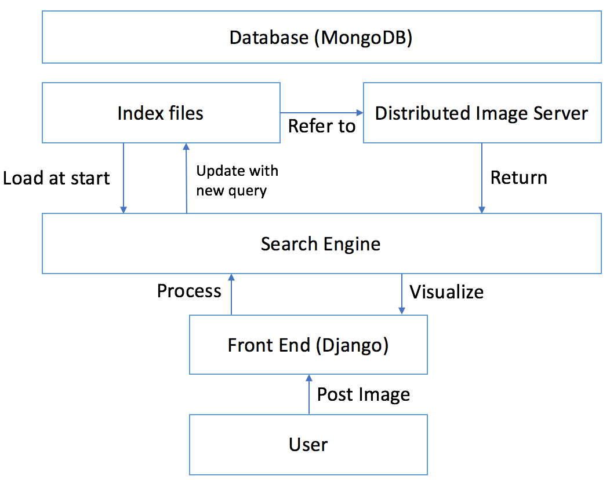
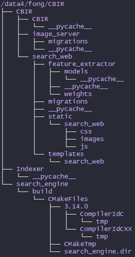

# ISeeNN
重建 [sunshaoyan的ISeeNN图像检索系统](https://github.com/sunshaoyan/ISeeNN) ，在其基础上有少量修改。


## 系统框架

包含三个部分
- Image Server
- Search Engine
- Front End



这里只使用一台服务器，不是上图的分布式架构。建议使用 [conda](https://conda.io/en/latest/) 配置环境。

项目目录如下：



## 设置

### MongoDB 数据库

使用的版本是 mongodb-linux-x86_64-ubuntu1604-4.2.2，安装过程参考[官方文档](https://docs.mongodb.com/guides/server/install/)。注意把 `bin` 目录加到 `~/.bashrc` 中。

#### 创建 admin 用户

执行 `./mongodb_first_run.sh` ，其内容如下：

```bash
USER=${MONGODB_USERNAME:-mongo}
PASS=${MONGODB_PASSWORD:-$(pwgen -s -1 16)}
DB=${MONGODB_DBNAME:-admin}
DBPATH=/data4/fong/ISeeNN/env/db
if [ ! -z "$MONGODB_DBNAME" ]
then
   ROLE=${MONGODB_ROLE:-dbOwner}
else
   ROLE=${MONGODB_ROLE:-dbAdminAnyDatabase}
fi

# Start MongoDB service
mongod --dbpath $DBPATH --nojournal &
while ! nc -vz localhost 27017; do sleep 1; done

# Create User
echo "Creating user: \"$USER\"..."
mongo $DB --eval "db.createUser({ user: '$USER', pwd: '$PASS', roles: [ { role: '$ROLE', db: '$DB' } ] }); "

# Stop MongoDB service
mongod --dbpath $DBPATH --shutdown
echo "========================================================================"
echo "MongoDB User: \"$USER\""
echo "MongoDB Password: \"$PASS\""
echo "MongoDB Database: \"$DB\""
echo "MongoDB Role: \"$ROLE\""
echo "========================================================================"

```

其中 `pwgen` 用于随机产生密码，这里可以直接改为自己想设置的密码；注意修改 `DBPATH` 。

#### 创建 webclient 用户

```bash
$ export MONGODB_USERNAME=webclient
$ export MONGODB_DBNAME=image_retrieval
$ ./mongodb_first_run.sh
MongoDB User: "webclient"
MongoDB Password: "xxxxxxxxxxxxxxxx"
MongoDB Database: "image_retrieval"
MongoDB Role: "dbOwner"
```

webclient 是数据库 image_retrieval 的管理员，后面索引的数据集都是放在 image_retrieval 里面。

#### 开启 MongoDB 服务

 在 `DBPATH` 下新建 `mongodb.conf` 和 `mongodb.log`，配置 `mongodb.conf` 如下：

 ```bash
dbpath=/data4/fong/ISeeNN/env/db
logpath=/data4/fong/ISeeNN/env/db/mongodb.log
logappend=true
journal=true
auth = true
bind_ip = 0.0.0.0
```

- `auth=true` 表示访问数据库需要进行身份验证。如果忘记了密码，将其设置为 `auth=false` 重新创建用户并删除原来的用户。
- `bind_ip` 用于绑定ip。MongoDB 默认监听的是`127.0.0.1:27017`（即 `localhost:27017`），因此是不允许远程访问的。所以安装mongodb时，如果要远程访问（使用ip访问，如服务器的内网ip`192.168.x.x`），应当在配置文件配置开启ip访问，设置为`0.0.0.0`或`192.168.x.x`；设置为`192.168.x.x`之后，`127.0.0.1:27017`就不能正常访问了。

访问 MongoDB 之前要保证服务一直是在开启状态：
```bash
mongod --config DBPATH/mongodb.conf
```

打开另一个终端，输入指令 `mongo` 即可进行测试。
```bash
$ mongo
MongoDB shell version v4.2.2
connecting to: mongodb://127.0.0.1:27017
MongoDB server version: 4.2.2
> use image_retrieval
switched to db image_retrieval
> db.auth('webclient', 'xxxxxxxxxxxxxxxx')
1
```

#### 插入 image_server

```
> db.image_server.insert({server_name: 'Center', server_ip: '192.168.x.x'})
```

### Django 开发环境

我使用的 python 版本是 3.7.5。

安装以下4个包：
```bash
$ pip install django
$ pip install mongoengine
$ pip install scikit-image
$ pip install Pillow
```
我使用的版本是
```
django                    3.0.1
mongoengine               0.19.0
pillow                    6.2.1
scikit-image              0.16.2 
```

建立一个 Django 项目，名为 **CBIR**，
```bash
$ django-admin startproject CBIR
$ tree CBIR
CBIR
├── CBIR
│   ├── __init__.py
│   ├── asgi.py
│   ├── settings.py
│   ├── urls.py
│   └── wsgi.py
└── manage.py
```

`settings.py` 需要修改的几个地方如下：
```python
ALLOWED_HOSTS = ['*']

TEMPLATES = [
    {
        ...
        'DIRS': [os.path.join(BASE_DIR, 'search_web', 'templates')],
        ...
    },
]

TIME_ZONE = 'Asia/Shanghai'
```

需要新增：
```python
_MONGODB_USER = 'webclient'
_MONGODB_PASSWD = 'xxxxxxxxxxxxxxxx'
_MONGODB_HOST = '192.168.x.x'
_MONGODB_NAME = 'image_retrieval'
_MONGODB_DATABASE_HOST = \
    'mongodb://%s:%s@%s/%s' \
    % (_MONGODB_USER, _MONGODB_PASSWD, _MONGODB_HOST, _MONGODB_NAME)
mongoengine.connect(_MONGODB_NAME, host=_MONGODB_DATABASE_HOST)

if DEBUG:
    STATICFILES_DIRS = [
        os.path.join(BASE_DIR, 'search_web', "static"),
    ]
else:
    STATIC_ROOT = "/data4/fong/CBIR/CBIR/search_web/static/"

SERVER_NAME = 'Center' # Change the server host name here on the central server and all image servers
FEATURE_MODEL = 'VGG19'
INPUT_TYPE = 'RESIZE' # options are: RESIZE, NO_RESIZE
INPUT_SIZE = (224, 224) # required only if INPUT_TYPE == RESIZE
NORMALIZER_TYPE = 'ROOT' # options are: ROOT, L2
FEATURE_IDENTITY = 'VGG19_resize' # should be consistent with FEATURE_MODEL and INPUT_TYPE
MAX_RETURN_ITEM = 300 # set as 0 if you want retrieve all. WARNING this may cause your browser crash if the database size is large
DATASETS = ['ukbench', 'oxford5k', 'paris6k'] # the list of dataset you want to retrieval within
```

说明：
- `ALLOWED_HOSTS = ['*']` 将允许通过 `localhost` 和 `192.168.x.x` 及端口号访问该项目。
- `DEBUG=False` 设置为生产环境，否则为开发环境（危险）。 
- `STATICFILES_DIRS` 和 `STATIC_ROOT` 的设置是为了让 Django 加载静态文件（css，js，images）；静态文件目录是`static/search_web`。

测试：
```bash
python manage.py runserver 8000
```

`urls.py` 也要做相应修改。

### Search Engine 编译

第一步，Ubuntu 系统安装 libboost:
```bash
sudo apt-get install libboost-dev libboost-python-dev
```

第二步，配置 `CmakeLists.txt`。

第三步，执行 `./build.sh` 。


### 建立索引

设置 `indexer.py` 里面的 `dataset`、`server_name`（对应`db.image_server.insert`） 及 `_MONGODB` 系列参数；执行 `python indexer.py` 。

## 运行项目

```bash
python manage.py runserver 0.0.0.0:8000
```

此时要保证 MongoDB 服务是开启状态。

访问 `http://192.168.x.x:8000/search_web/` 。